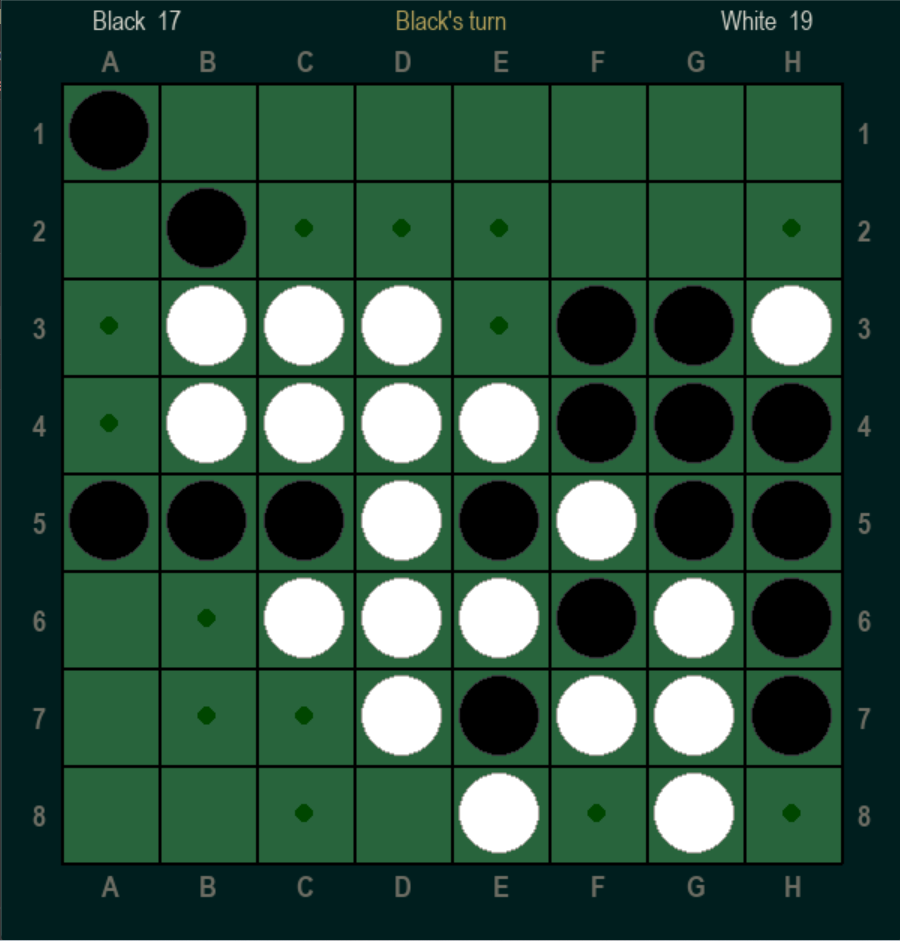

# 🕹️ Othello Game (Reversi)

A Python implementation of the classic **Othello (Reversi)** board game built with **Pygame**.

## Screenshot


## 🎮 Features
- Play **1 vs 1** or **1 vs Computer (AI using Minimax)**.
- Alpha Beta pruning.
- Animated board updates.
- Score tracking and winner detection.
- Simple main menu interface.

## 🧠 How to Play
1. Run the game with:
   ```bash
   python Othello.py

## 🧩 Requirements
   pip install -r pygame
